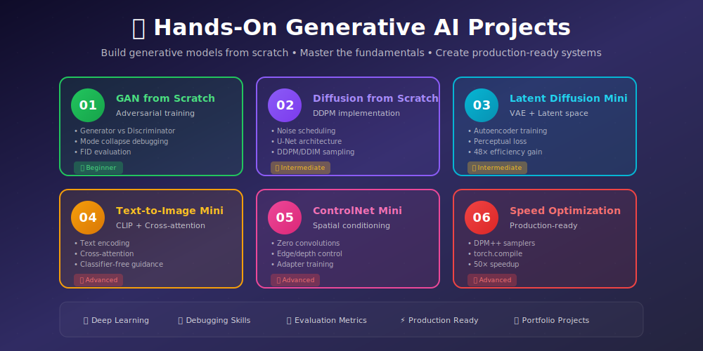
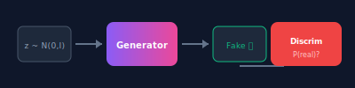
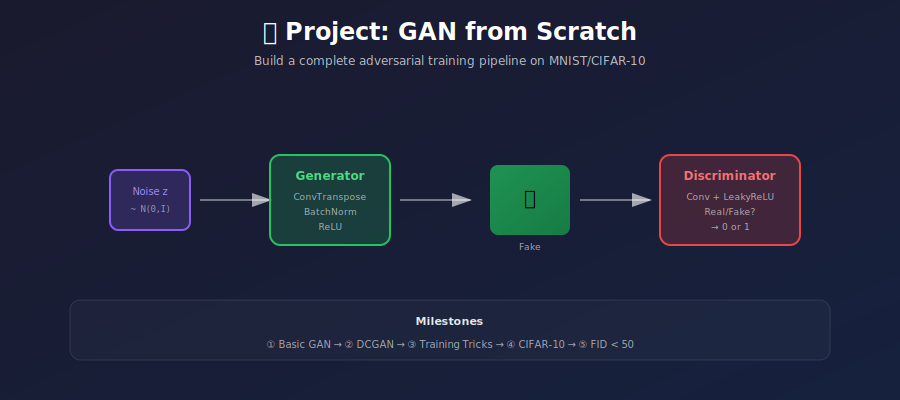
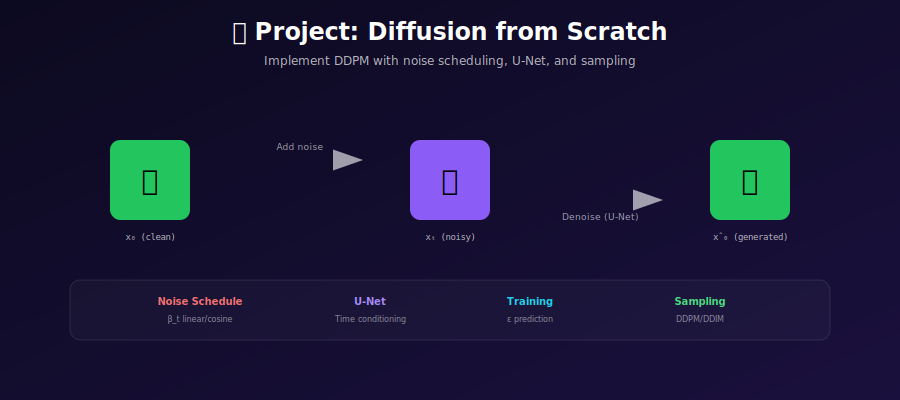
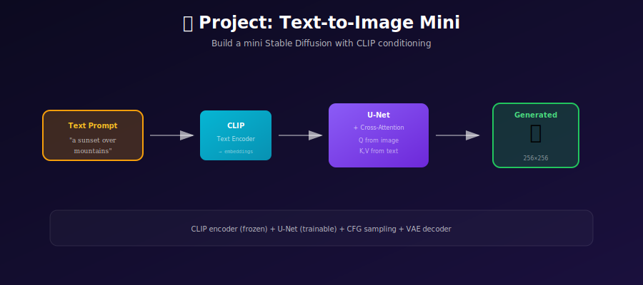
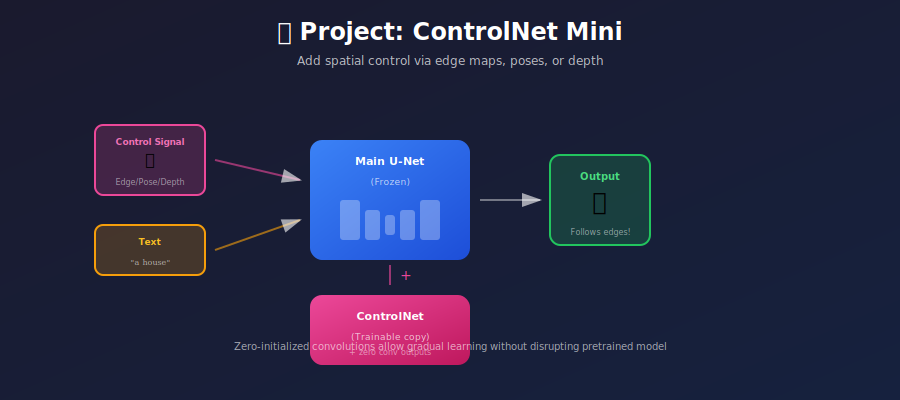
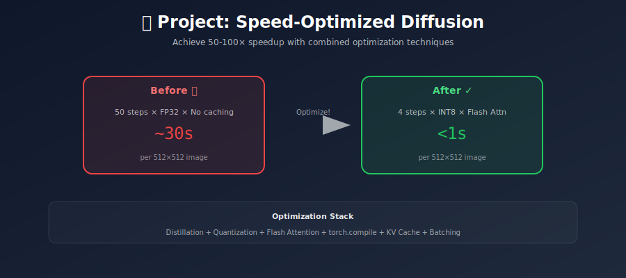

# 🛠️ Hands-On Generative AI Projects

<div align="center">



*Build generative models from scratch to truly understand them*

[](#-project-1-gan-from-scratch)
[](#-project-2-diffusion-from-scratch)
[](#-project-4-text-to-image-mini)

</div>

---

## 🎯 Why Build From Scratch?

<table>
<tr>
<th width="25%">🧠 Deep Understanding</th>
<th width="25%">🔧 Debugging Skills</th>
<th width="25%">🎨 Customization</th>
<th width="25%">💼 Portfolio</th>
</tr>
<tr>
<td>Implementing every component reveals insights that reading papers alone cannot provide</td>
<td>Learn to diagnose mode collapse, training instabilities, and quality issues</td>
<td>Modify architectures for your specific use cases and constraints</td>
<td>Demonstrate practical skills to employers with working implementations</td>
</tr>
</table>

---

## 📚 Project Roadmap

| # | Project | Difficulty | Time | What You'll Build |
|:-:|---------|:----------:|:----:|-------------------|
| 🟢 | **[GAN from Scratch](./01_gan_from_scratch/)** | Beginner | 1-2 weeks | Complete DCGAN with adversarial training |
| 🟡 | **[Diffusion from Scratch](./02_diffusion_from_scratch/)** | Intermediate | 3-5 days | DDPM with noise scheduling & U-Net |
| 🟡 | **[Latent Diffusion Mini](./03_latent_diffusion_mini/)** | Intermediate | 1 week | VAE + latent space diffusion |
| 🔴 | **[Text-to-Image Mini](./04_text_to_image_mini/)** | Advanced | 2 weeks | CLIP conditioning + cross-attention |
| 🔴 | **[ControlNet Mini](./05_controlnet_mini/)** | Advanced | 1 week | Zero convolutions + spatial control |
| 🔴 | **[Speed Optimized Diffusion](./06_speed_optimized_diffusion/)** | Advanced | 1 week | DPM++ samplers + 50× speedup |

---

## 🟢 Project 1: GAN from Scratch

<table>
<tr>
<td width="60%">

### What You'll Build

A complete **DCGAN** that generates realistic handwritten digits and CIFAR-10 images.

### Key Learning Objectives

- 🎲 Implement adversarial minimax training
- ⚖️ Balance Generator vs Discriminator
- 🐛 Debug mode collapse and instabilities
- 📊 Evaluate with FID and Inception Score

### Architecture Preview



</td>
<td width="40%">



**Milestones:**
- [ ] Basic MLP GAN
- [ ] DCGAN architecture
- [ ] Training tricks
- [ ] FID < 50

</td>
</tr>
</table>

**[→ Start Project 1](./01_gan_from_scratch/)**

---

## 🟡 Project 2: Diffusion from Scratch

<table>
<tr>
<td width="60%">

### What You'll Build

A complete **DDPM** that generates images through iterative denoising.

### Key Learning Objectives

- 📊 Implement linear/cosine noise schedules
- 🏗️ Build U-Net with time conditioning
- 🔄 Understand forward/reverse processes
- ⚡ Implement DDPM and DDIM sampling

### The Core Idea

$$x_t = \sqrt{\bar{\alpha}_t} x_0 + \sqrt{1-\bar{\alpha}_t} \epsilon$$

Learn to predict and remove the noise \(\epsilon\) step by step!

</td>
<td width="40%">



**Milestones:**
- [ ] Noise schedule
- [ ] U-Net architecture
- [ ] DDPM sampling (1000 steps)
- [ ] DDIM sampling (50 steps)

</td>
</tr>
</table>

**[→ Start Project 2](./02_diffusion_from_scratch/)**

---

## 🟡 Project 3: Latent Diffusion Mini

<table>
<tr>
<td width="60%">

### What You'll Build

A mini **Stable Diffusion**: VAE compression + latent space diffusion.

### Key Learning Objectives

- 📦 Train a VAE with perceptual loss
- 💎 Run diffusion in compressed latent space
- ⚡ Achieve 48× efficiency improvement
- 🔗 Understand two-stage training

### Why Latent Space?

| Space | Dimensions | Values |
|-------|------------|--------|
| Pixel | 512×512×3 | 786,432 |
| Latent | 64×64×4 | 16,384 |
| **Reduction** | | **48×** |

</td>
<td width="40%">


**Milestones:**
- [ ] VAE encoder/decoder
- [ ] Perceptual loss (LPIPS)
- [ ] Latent diffusion training
- [ ] End-to-end generation

</td>
</tr>
</table>

**[→ Start Project 3](./03_latent_diffusion_mini/)**

---

## 🔴 Project 4: Text-to-Image Mini

<table>
<tr>
<td width="60%">

### What You'll Build

A minimal **text-to-image** system with CLIP and cross-attention.

### Key Learning Objectives

- 📝 Use pretrained CLIP for text encoding
- 🎯 Implement cross-attention conditioning
- 🎛️ Apply classifier-free guidance (CFG)
- 🚀 Build an interactive demo

### The CFG Formula

$$\tilde{\epsilon} = \epsilon_{uncond} + w \cdot (\epsilon_{cond} - \epsilon_{uncond})$$

Control quality vs diversity with guidance scale \(w\)!

</td>
<td width="40%">



**Milestones:**
- [ ] CLIP text encoding
- [ ] Cross-attention layers
- [ ] CFG training & inference
- [ ] Gradio demo

</td>
</tr>
</table>

**[→ Start Project 4](./04_text_to_image_mini/)**

---

## 🔴 Project 5: ControlNet Mini

<table>
<tr>
<td width="60%">

### What You'll Build

A **ControlNet** adapter for spatial control (edges, depth, pose).

### Key Learning Objectives

- 0️⃣ Implement zero convolutions
- 🔒 Clone and freeze base model weights
- 🎛️ Train spatial conditioning adapters
- 🎨 Compose multiple control signals

### The Zero Conv Trick

```python
# Initialize to output zeros
nn.init.zeros_(conv.weight)
nn.init.zeros_(conv.bias)
```

This allows gradual learning without disturbing the base model!

</td>
<td width="40%">



**Milestones:**
- [ ] Zero convolutions
- [ ] Canny edge control
- [ ] Depth map control
- [ ] Multi-control fusion

</td>
</tr>
</table>

**[→ Start Project 5](./05_controlnet_mini/)**

---

## 🔴 Project 6: Speed Optimized Diffusion

<table>
<tr>
<td width="60%">

### What You'll Build

Production-ready diffusion with **50× speedup**.

### Key Learning Objectives

- ⚡ Implement DPM++ solvers (20 steps)
- 🔧 Apply torch.compile optimization
- 💾 Use FP16/BF16 mixed precision
- 📊 Profile and benchmark systematically

### Optimization Stack

| Technique | Speedup | Memory |
|-----------|---------|--------|
| DDIM (50 steps) | 20× | Same |
| DPM++ (20 steps) | 2.5× | Same |
| torch.compile | 1.5× | Same |
| FP16 | 1.5× | 0.5× |
| xFormers | 1.2× | 0.6× |

</td>
<td width="40%">



**Milestones:**
- [ ] DDIM sampler
- [ ] DPM++ 2M solver
- [ ] torch.compile
- [ ] TensorRT deployment

</td>
</tr>
</table>

**[→ Start Project 6](./06_speed_optimized_diffusion/)**

---

## 📈 Learning Path

```
┌─────────────────────────────────────────────────────────────┐
│                     YOUR JOURNEY                             │
├─────────────────────────────────────────────────────────────┤
│                                                              │
│  🟢 GAN ──▶ 🟡 Diffusion ──▶ 🟡 Latent ──┐                 │
│                                           │                  │
│                               ┌───────────┘                  │
│                               ▼                              │
│                    🔴 Text-to-Image                         │
│                               │                              │
│                    ┌──────────┴──────────┐                  │
│                    ▼                     ▼                   │
│              🔴 ControlNet        🔴 Speed Opt              │
│                                                              │
└─────────────────────────────────────────────────────────────┘
```

---

## 🏆 Tips for Success

### 1. Start Small
- Begin with 28×28 (MNIST) or 32×32 (CIFAR) images
- Verify each component before combining
- Use small batch sizes for debugging

### 2. Visualize Everything
- Plot loss curves (they have characteristic shapes!)
- Generate samples throughout training
- Visualize attention maps and latent spaces

### 3. Common Pitfalls to Avoid

| Mistake | Symptom | Fix |
|---------|---------|-----|
| Forgetting `.detach()` | GAN: G and D losses coupled | Detach fake images when training D |
| Wrong normalization | Images look washed out | Use [-1, 1] for Tanh output |
| Incorrect timesteps | Diffusion diverges | Check embedding dimensions |
| Missing gradient clip | NaN losses | Add `clip_grad_norm_(params, 1.0)` |

### 4. Use Reference Implementations
- Compare gradients to known-good code
- Verify intermediate tensor shapes
- Don't be afraid to print debug info

---

## 📚 Resources

### Code References
- **[Diffusers](https://github.com/huggingface/diffusers)** — HuggingFace's production implementation
- **[labml.ai](https://nn.labml.ai/diffusion/)** — Annotated, educational implementations
- **[Phil Wang's repos](https://github.com/lucidrains)** — Clean, minimal PyTorch code

### Datasets
| Dataset | Resolution | Type | Good For |
|---------|------------|------|----------|
| MNIST | 28×28 | Grayscale | First experiments |
| CIFAR-10 | 32×32 | Color | Quick iterations |
| CelebA | 64×64 | Faces | Face generation |
| LAION | Various | Web images | Scaling up |

### Papers
- **GANs**: [Goodfellow et al. 2014](https://arxiv.org/abs/1406.2661)
- **DDPM**: [Ho et al. 2020](https://arxiv.org/abs/2006.11239)
- **LDM**: [Rombach et al. 2022](https://arxiv.org/abs/2112.10752)
- **ControlNet**: [Zhang et al. 2023](https://arxiv.org/abs/2302.05543)

---

<div align="center">

## 🚀 Ready to Begin?

**[Start with Project 1: GAN from Scratch →](./01_gan_from_scratch/)**

*Build your first generative model today!*

---

<sub>Made with ❤️ for the generative AI community</sub>

</div>
