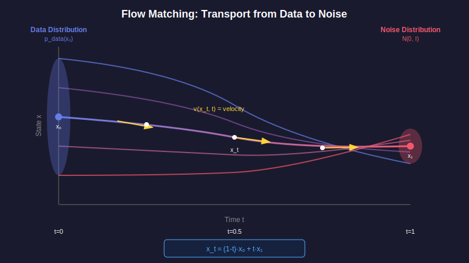
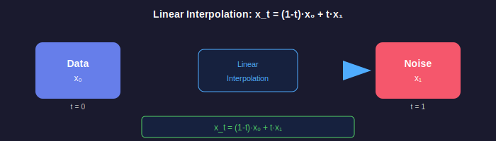
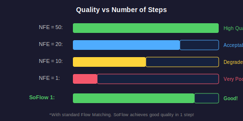

# 📖 Chapter 2: Flow Matching Basics

<div align="center">

*Understanding the foundation that SoFlow builds upon*

</div>

---

## 🌊 What is Flow Matching?

Flow Matching is a framework for **transporting** one probability distribution to another along a continuous path.



> 🎯 **Goal**: Learn a transformation from noise distribution $p_1 = \mathcal{N}(0, I)$ to data distribution $p_0 = p_{data}$

---

## 📐 Mathematical Foundation

### Probability Distributions

| Symbol | Distribution | Meaning |
|:------:|:------------:|:--------|
| $p_0(x)$ | Data distribution | Real images |
| $p_1(x)$ | $\mathcal{N}(0, I)$ | Gaussian noise |
| $p_t(x)$ | Intermediate | Mix of data and noise |

### The Probability Path

We define a time-dependent distribution $p_t(x)$ that smoothly interpolates:

$$p_t(x): \quad p_0 \xrightarrow{t \in [0,1]} p_1$$

At $t=0$: pure data. At $t=1$: pure noise.

---

## 📐 Linear Interpolation Path

### The Formula

Given a data sample $x_0 \sim p_0$ and noise sample $x_1 \sim \mathcal{N}(0, I)$, define:

$$x_t = (1 - t) \cdot x_0 + t \cdot x_1$$



### Properties of Linear Interpolation

| Property | Formula | Value at $t$ |
|:--------:|:-------:|:------------:|
| **Mean** | $\mathbb{E}[x_t \| x_0]$ | $(1-t) \cdot x_0$ |
| **Variance** | $\text{Var}[x_t \| x_0]$ | $t^2 \cdot I$ |
| **At $t=0$** | $x_0$ | Pure data |
| **At $t=0.5$** | $0.5 x_0 + 0.5 x_1$ | 50/50 mix |
| **At $t=1$** | $x_1$ | Pure noise |

### Why Linear?

1. **Simple**: No complicated variance schedules (unlike DDPM)
2. **Straight paths**: Optimal transport perspective
3. **Easy derivatives**: Velocity is constant per trajectory

---

## 🏃 The Velocity Field

### Definition

The **velocity field** $v(x, t)$ describes how samples move through time:

$$v(x, t) = \frac{dx_t}{dt}$$

### Conditional Velocity

For a specific trajectory (given $x_0$ and $x_1$):

$$v(x_t | x_0, x_1) = \frac{d}{dt}\left[(1-t)x_0 + tx_1\right] = x_1 - x_0$$

> 💡 **Key Insight**: The conditional velocity is **constant** along each trajectory!

### Marginal Velocity

The marginal (unconditional) velocity satisfies the **continuity equation**:

$$\frac{\partial p_t(x)}{\partial t} + \nabla \cdot \left(p_t(x) \cdot v(x, t)\right) = 0$$

This is a partial differential equation (PDE) that describes probability flow.

---

## 📐 The Flow ODE

### Definition

Given velocity field $v(x, t)$, the **flow ODE** is:

$$\frac{dx}{dt} = v(x, t), \quad x(1) = x_1 \sim \mathcal{N}(0, I)$$

### Solution

Solving this ODE from $t=1$ to $t=0$ gives:

$$x_0 = x_1 - \int_1^0 v(x_\tau, \tau) \, d\tau = x_1 + \int_0^1 v(x_\tau, \tau) \, d\tau$$

### Numerical Integration

Using Euler method with $N$ steps:

$$x_{t_{i-1}} = x_{t_i} + v(x_{t_i}, t_i) \cdot (t_{i-1} - t_i)$$

where $t_N = 1, t_{N-1}, \ldots, t_0 = 0$.

---

## 🎓 Training Flow Matching

### The Objective

Learn a neural network $v_\theta(x_t, t)$ that approximates the true velocity:

$$\mathcal{L}_{FM} = \mathbb{E}_{x_0 \sim p_0, x_1 \sim \mathcal{N}(0,I), t \sim \mathcal{U}(0,1)} \left[ \| v_\theta(x_t, t) - (x_1 - x_0) \|^2 \right]$$

### Why This Works

The conditional flow matching theorem states that minimizing the above loss is equivalent to learning the marginal velocity field under mild conditions.

### Training Code

```python
def flow_matching_loss(model, x_0, x_1, t):
    """
    Standard Flow Matching training loss.
    
    Args:
        model: Neural network v_θ(x, t)
        x_0: Clean data samples [B, C, H, W]
        x_1: Noise samples [B, C, H, W]
        t: Time values [B]
    
    Returns:
        Scalar loss value
    """
    # Reshape t for broadcasting
    t = t.view(-1, 1, 1, 1)
    
    # Create interpolated sample
    x_t = (1 - t) * x_0 + t * x_1
    
    # True velocity (constant for linear interpolation!)
    v_true = x_1 - x_0
    
    # Predicted velocity
    v_pred = model(x_t, t.squeeze())
    
    # MSE loss
    loss = F.mse_loss(v_pred, v_true)
    
    return loss
```

---

## 🎨 Generation: The Slow Part

To generate an image, we must **solve the ODE backward** from noise:

### The Algorithm

```python
def generate_flow_matching(model, num_steps=50):
    """
    Generate images via numerical ODE solving.
    
    Args:
        model: Trained velocity network v_θ
        num_steps: Number of integration steps
    
    Returns:
        Generated images
    """
    # Start with noise at t=1
    x = torch.randn(batch_size, C, H, W)
    
    # Time steps from 1 to 0
    dt = -1.0 / num_steps
    
    for i in range(num_steps):
        t = 1.0 - i / num_steps
        
        # Predict velocity (FORWARD PASS!)
        v = model(x, t)
        
        # Euler step
        x = x + v * dt
    
    return x  # After many forward passes...
```

> 🐌 **The Problem**: Each step requires a full forward pass through the neural network!

### Computational Cost

| Steps | Forward Passes | Time (relative) |
|:-----:|:--------------:|:---------------:|
| 1000 (DDPM) | 1000 | 100× |
| 50 (DDIM) | 50 | 5× |
| 20 (Fast) | 20 | 2× |
| **1 (SoFlow)** | **1** | **1×** |

---

## 📉 Quality vs Speed Trade-off



### Standard Flow Matching

| Steps | FID ↓ | Time | Quality |
|:-----:|:-----:|:----:|:-------:|
| 100 | ~2.5 | Slow | ⭐⭐⭐⭐⭐ |
| 50 | ~3.0 | Medium | ⭐⭐⭐⭐ |
| 20 | ~5.0 | Fast | ⭐⭐⭐ |
| 10 | ~10.0 | Very Fast | ⭐⭐ |
| 1 | ~50+ | Instant | ⭐ |

### The Fundamental Limitation

Reducing steps causes:
1. **Discretization error**: Euler method is only first-order accurate
2. **Accumulation**: Errors compound over the trajectory
3. **Quality degradation**: Severe at very few steps

> ❓ **The Question**: Can we bypass this limitation entirely?

---

## 🤔 The Key Question

> *What if we could skip all these steps and directly predict the final image?*

That's exactly what **SoFlow's Solution Function** does!

### The Paradigm Shift

**Standard Flow Matching:**
1. Learn velocity $v(x_t, t)$
2. Solve ODE numerically: $x_0 = x_1 + \int_0^1 v(x_\tau, \tau) \, d\tau$
3. Requires many steps

**SoFlow:**
1. Learn solution $f(x_t, t, s)$
2. Query directly: $x_0 = f(x_1, 1, 0)$
3. **ONE step!**

### Mathematical Comparison

| | Flow Matching | SoFlow |
|:--|:-------------:|:------:|
| **Learn** | $v_\theta(x_t, t)$ | $f_\theta(x_t, t, s)$ |
| **Generate** | $x_1 + \int_0^1 v \, d\tau$ | $f(x_1, 1, 0)$ |
| **Steps** | 50-1000 | **1** |
| **Error** | $O(1/N)$ | **0** (direct) |

---

## 🔑 Key Takeaways

<table>
<tr>
<td>

### 📚 What We Learned
- Linear interpolation: $x_t = (1-t)x_0 + tx_1$
- Velocity field: $v = x_1 - x_0$ (constant)
- ODE: $dx/dt = v(x,t)$
- Generation needs many steps

</td>
<td>

### 🚀 Where We're Going
- Solution function skips ODE solving
- One-step generation is possible
- No discretization error
- SoFlow makes it work!

</td>
</tr>
</table>

---

## 📊 Mathematical Summary

| Concept | Formula |
|:-------:|:-------:|
| **Interpolation** | $x_t = (1-t)x_0 + tx_1$ |
| **Velocity** | $v = dx_t/dt = x_1 - x_0$ |
| **Flow ODE** | $dx/dt = v(x,t)$ |
| **Training Loss** | $\mathcal{L} = \mathbb{E}[\|v_\theta(x_t, t) - (x_1-x_0)\|^2]$ |
| **Generation** | $x_0 = x_1 + \int_0^1 v(x_\tau, \tau) \, d\tau$ |

---

## 📚 What's Next?

Ready to see how SoFlow reformulates this problem?

<div align="center">

**[← Chapter 1: Introduction](../01-introduction/README.md)** | **[Chapter 3: Solution Function →](../03-solution-function/README.md)**

</div>

---

<div align="center">

*Chapter 2 of 9 • [Back to Index](../README.md)*

</div>
