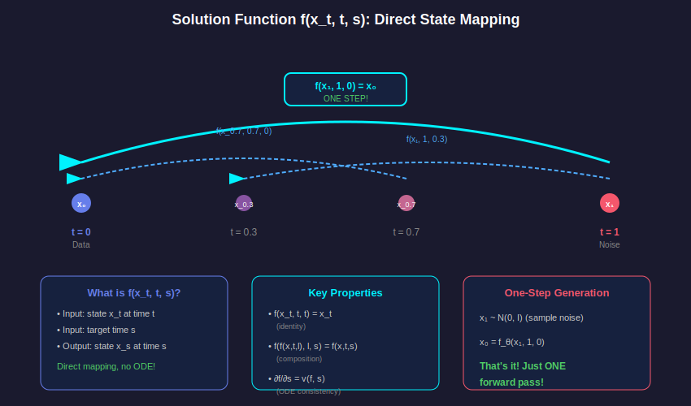
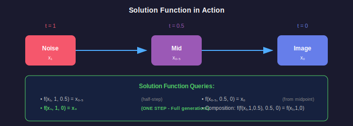

# 📖 Chapter 3: The Solution Function

<div align="center">

*The key innovation that enables one-step generation*

</div>

---

## 💡 The Big Idea

Instead of learning **how to move** (velocity), we learn **where to go** (solution):



> 🎯 **The Solution Function** $f(x_t, t, s)$ directly maps state $x_t$ at time $t$ to state $x_s$ at time $s$

---

## 📐 Formal Definition

### Definition: Solution Function

Given an ODE defined by velocity field $v(x, t)$:

$$\frac{dx}{dt} = v(x, t)$$

The **solution function** $f: \mathbb{R}^d \times [0,1] \times [0,1] \to \mathbb{R}^d$ is defined as:

$$f(x_t, t, s) = x_t + \int_t^s v(f(x_t, t, \tau), \tau) \, d\tau$$

In words: $f(x_t, t, s)$ gives the state at time $s$ starting from state $x_t$ at time $t$, following the ODE trajectory.

### Notation

| Symbol | Meaning |
|:------:|:--------|
| $x_t$ | State at time $t$ |
| $t$ | Current/starting time |
| $s$ | Target/ending time |
| $v(x, t)$ | Velocity field |
| $f(x_t, t, s)$ | Solution function |

---

## 🔮 What Does It Mean?

$$f(x_t, t, s) = x_s$$

**In plain English:**
> "Given a noisy image at time $t$, tell me what it looks like at time $s$"

### The Magic Query for Generation

For one-step generation, we query:

$$\text{image} = f(\text{noise}, t=1, s=0)$$

```python
# 🚀 The SoFlow way - ONE step!
noise = torch.randn(batch_size, 3, 256, 256)
image = model(noise, t=1, s=0)  # That's it!
```

---

## 📐 Three Fundamental Properties

### Property 1: Identity

$$f(x_t, t, t) = x_t$$

> *"If the target time equals the current time, nothing changes."*

**Proof:**
$$f(x_t, t, t) = x_t + \int_t^t v(\cdot) \, d\tau = x_t + 0 = x_t \quad \blacksquare$$

### Property 2: Composition (Semi-group)

$$f(f(x_t, t, l), l, s) = f(x_t, t, s) \quad \forall \, s \leq l \leq t$$

> *"Going $t \to l \to s$ equals going $t \to s$ directly."*

**Proof:**
Let $x_l = f(x_t, t, l)$. Then:
$$f(x_l, l, s) = x_l + \int_l^s v(\cdot) \, d\tau$$
$$= f(x_t, t, l) + \int_l^s v(\cdot) \, d\tau$$
$$= x_t + \int_t^l v(\cdot) \, d\tau + \int_l^s v(\cdot) \, d\tau$$
$$= x_t + \int_t^s v(\cdot) \, d\tau = f(x_t, t, s) \quad \blacksquare$$

### Property 3: ODE Consistency

$$\frac{\partial f(x_t, t, s)}{\partial s} = v(f(x_t, t, s), s)$$

> *"The derivative with respect to target time gives the velocity at that point."*

**Proof:**
By the Fundamental Theorem of Calculus:
$$\frac{\partial}{\partial s} \left[ x_t + \int_t^s v(f(x_t, t, \tau), \tau) \, d\tau \right] = v(f(x_t, t, s), s) \quad \blacksquare$$

---

## 🆚 Velocity vs Solution: A Mathematical Comparison

| Aspect | Velocity $v(x_t, t)$ | Solution $f(x_t, t, s)$ |
|:------:|:-------------------:|:-----------------------:|
| **Definition** | $\frac{dx}{dt}$ | $x_t + \int_t^s v \, d\tau$ |
| **Output** | Instantaneous direction | Final destination |
| **Dimension** | $\mathbb{R}^d \times [0,1] \to \mathbb{R}^d$ | $\mathbb{R}^d \times [0,1]^2 \to \mathbb{R}^d$ |
| **Generation** | Solve ODE numerically | Single forward pass |
| **Steps needed** | 50-1000 | **1** |

### Generation Comparison

**Velocity-based (50+ steps):**
$$x_0 = x_T - \sum_{i=1}^{N} v(x_{t_i}, t_i) \cdot \Delta t$$

**Solution-based (1 step):**
$$x_0 = f(x_T, T, 0)$$

---

## 🎬 Visualizing the Trajectory



### Example Queries Along the Trajectory

| Query | Mathematical Form | Result |
|:------|:-----------------:|:------:|
| Halfway point | $f(x_1, 1, 0.5)$ | $x_{0.5}$ |
| **Final image** | $f(x_1, 1, 0)$ | $x_0$ |
| From midpoint | $f(x_{0.5}, 0.5, 0)$ | $x_0$ |
| Small step | $f(x_t, t, t-\epsilon)$ | $x_{t-\epsilon}$ |

### Composition Example

$$f(x_1, 1, 0) = f(f(x_1, 1, 0.5), 0.5, 0)$$

Both paths lead to the same clean image $x_0$!

---

## 🏗️ Model Architecture Change

### Standard Flow Matching Model (Velocity)

```python
class VelocityModel(nn.Module):
    def forward(self, x_t, t):
        """
        Args:
            x_t: Noisy sample at time t [B, C, H, W]
            t: Time value [B]
        Returns:
            v: Velocity vector [B, C, H, W]
        """
        # ... neural network ...
        return velocity
```

### SoFlow Model (Solution)

```python
class SolutionModel(nn.Module):
    def forward(self, x_t, t, s):
        """
        Args:
            x_t: State at time t [B, C, H, W]
            t: Current time [B]
            s: Target time [B]  ← NEW INPUT!
        Returns:
            x_s: State at time s [B, C, H, W]
        """
        # ... neural network with two time embeddings ...
        return x_s
```

> 🔑 **Key Change**: Add target time $s$ as a new input to the model!

---

## ⚡ Extracting Velocity from Solution

Even though we learn the solution function, we can **extract velocity** using Property 3:

### Mathematical Derivation

From the ODE consistency property:

$$v(x_t, t) = \frac{\partial f(x_t, t, s)}{\partial s} \bigg|_{s=t}$$

Using finite differences for numerical approximation:

$$v(x_t, t) \approx \frac{f(x_t, t, t-\epsilon) - f(x_t, t, t)}{-\epsilon} = \frac{f(x_t, t, t-\epsilon) - x_t}{-\epsilon}$$

### Implementation

```python
def extract_velocity(model, x_t, t, eps=1e-4):
    """
    Extract velocity from solution function.
    
    Uses the relationship: v = ∂f/∂s
    
    Args:
        model: Trained solution function f_θ
        x_t: Current state [B, C, H, W]
        t: Current time [B]
        eps: Small time step for finite difference
    
    Returns:
        v: Extracted velocity [B, C, H, W]
    """
    s = t - eps  # Small step backward
    f_out = model(x_t, t, s)
    
    # Finite difference approximation
    velocity = (f_out - x_t) / (-eps)
    
    return velocity
```

> 💡 This enables **Classifier-Free Guidance** without additional training! (More in Chapter 6)

---

## 🤔 The Training Challenge

### The Problem

We want to train $f_\theta(x_t, t, s)$ but:

1. We don't have ground truth for arbitrary $(x_t, t, s)$ triplets
2. We only have pairs $(x_0, x_1)$ of data and noise
3. The trajectory is defined implicitly by the ODE

### SoFlow's Solution: Two Complementary Losses

| Loss | What it supervises | How |
|:----:|:------------------:|:---:|
| **Flow Matching** | Endpoint prediction | $f_\theta(x_t, t, 0) \approx x_0$ |
| **Consistency** | Trajectory consistency | $f_\theta(x_t, t, s) \approx f_\theta(x_l, l, s)$ |

### Mathematical Formulation

$$\mathcal{L}_{total} = \underbrace{\mathbb{E}[\|f_\theta(x_t, t, 0) - x_0\|^2]}_{\text{Flow Matching}} + \lambda \underbrace{\mathbb{E}[\|f_\theta(x_t, t, s) - \text{sg}[f_\theta(x_l, l, s)]\|^2]}_{\text{Consistency}}$$

---

## 📊 Computational Comparison

| Method | Forward Passes | Backward Passes | JVP | Total Cost |
|:------:|:--------------:|:---------------:|:---:|:----------:|
| Flow Matching | 1 | 1 | ❌ | 2× |
| Consistency Models | 2 | 2 | ✅ | 5× |
| MeanFlow | 2 | 2 | ✅ | 5× |
| **SoFlow** | 2 | 1 | ❌ | **3×** |

> 🚀 SoFlow is **40% faster** than methods requiring JVP!

---

## 🔑 Key Takeaways

<table>
<tr>
<td width="50%">

### 📚 What We Learned
- Solution function: $f(x_t, t, s) = x_s$
- Three properties: Identity, Composition, ODE
- Extra input $s$ for target time
- Velocity extractable via $\partial f/\partial s$

</td>
<td width="50%">

### 🎉 The Payoff
- One-step generation: $f(\text{noise}, 1, 0)$
- Velocity extraction enables CFG
- Foundation for efficient training
- No numerical ODE solver needed

</td>
</tr>
</table>

---

## 📚 What's Next?

How do we actually train this solution function?

<div align="center">

**[← Chapter 2: Flow Matching](../02-flow-matching/README.md)** | **[Chapter 4: Training →](../04-training/README.md)**

</div>

---

<div align="center">

*Chapter 3 of 9 • [Back to Index](../README.md)*

</div>
