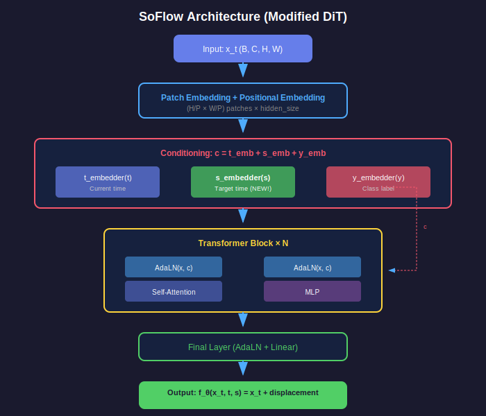

# 📖 Chapter 7: Model Architecture

<div align="center">

*How to modify DiT for solution function learning*

</div>

---

## 🏗️ Overview

SoFlow uses **Diffusion Transformer (DiT)** with one key modification:



> 🔑 **Key Change**: Add target time `s` as a new input!

---

## 🔄 Standard DiT vs SoFlow DiT

### Standard DiT (Velocity)

```python
class StandardDiT:
    def forward(self, x_t, t, y):
        # Inputs: noisy image, time, class
        return velocity
```

### SoFlow DiT (Solution)

```python
class SoFlowDiT:
    def forward(self, x_t, t, s, y):  # ← Added 's'!
        # Inputs: noisy image, current time, TARGET time, class
        return x_s
```

---

## 🧱 Architecture Components

### 1️⃣ Patch Embedding

Convert image to sequence of tokens:

```python
patches = patchify(image)  # [B, C, H, W] → [B, N, D]
tokens = linear(patches) + pos_embedding
```

### 2️⃣ Time Embeddings (Two of them!)

```python
class TimestepEmbedder(nn.Module):
    def forward(self, t):
        # Sinusoidal → MLP
        freqs = sin_cos_embedding(t)
        return mlp(freqs)

# SoFlow uses TWO embedders
t_emb = t_embedder(t)  # Current time
s_emb = s_embedder(s)  # Target time ← NEW!
```

### 3️⃣ Combined Conditioning

```python
# All conditions combined
c = t_emb + s_emb + y_emb
```

### 4️⃣ Transformer Blocks with AdaLN

```python
class DiTBlock(nn.Module):
    def forward(self, x, c):
        # AdaLN-conditioned self-attention
        x = x + attn(adaln(x, c))
        x = x + mlp(adaln(x, c))
        return x
```

---

## 🎛️ Adaptive Layer Normalization

### Standard LayerNorm
```
out = γ · normalize(x) + β
```

### AdaLN (Adaptive)
```
γ, β = linear(c)  # Learn from conditioning
out = (1 + γ) · normalize(x) + β
```

```python
class AdaLayerNorm(nn.Module):
    def forward(self, x, c):
        shift, scale = self.linear(c).chunk(2, dim=-1)
        return self.norm(x) * (1 + scale) + shift
```

---

## 📐 Model Sizes

| Model | Depth | Hidden | Heads | Params |
|:-----:|:-----:|:------:|:-----:|:------:|
| S/2 | 12 | 384 | 6 | ~33M |
| B/2 | 12 | 768 | 12 | ~130M |
| L/2 | 24 | 1024 | 16 | ~458M |
| XL/2 | 28 | 1152 | 16 | ~675M |

> `/2` means patch size = 2

---

## 🔀 Residual Output

The model predicts a **displacement**, not the final image:

```python
def forward(self, x_t, t, s, y):
    displacement = self.backbone(x_t, t, s, y)
    return x_t + displacement  # Residual!
```

### Why Residual?

| Benefit | Explanation |
|:-------:|:-----------:|
| **Identity Init** | `f(x,t,t) ≈ x` when displacement ≈ 0 |
| **Stable Training** | Learn small deltas, not absolute values |
| **Better Gradients** | Residual connections help gradient flow |

---

## 🖼️ Full Forward Pass

```python
class SoFlowDiT(nn.Module):
    def forward(self, x, t, s, y):
        # 1. Patchify + position embedding
        x = self.patch_embed(x) + self.pos_embed
        
        # 2. Time embeddings (both t and s!)
        t_emb = self.t_embedder(t)
        s_emb = self.s_embedder(s)  # ← NEW
        y_emb = self.y_embedder(y)
        c = t_emb + s_emb + y_emb
        
        # 3. Transformer blocks
        for block in self.blocks:
            x = block(x, c)
        
        # 4. Final layer + unpatchify
        x = self.final_layer(x, c)
        displacement = self.unpatchify(x)
        
        # 5. Residual connection
        return input_x + displacement
```

---

## 🔑 Key Takeaways

<table>
<tr>
<td>

### 📚 Architecture
- DiT backbone
- Two time embedders (t and s)
- AdaLN conditioning
- Residual output

</td>
<td>

### 💡 Key Change
Just add one embedder for `s`!

Everything else stays the same.

</td>
</tr>
</table>

---

## 📚 What's Next?

How does SoFlow compare to other methods?

<div align="center">

**[← Chapter 6: CFG](../06-cfg/README.md)** | **[Chapter 8: Comparison →](../08-comparison/README.md)**

</div>

---

<div align="center">

*Chapter 7 of 9 • [Back to Index](../README.md)*

</div>
