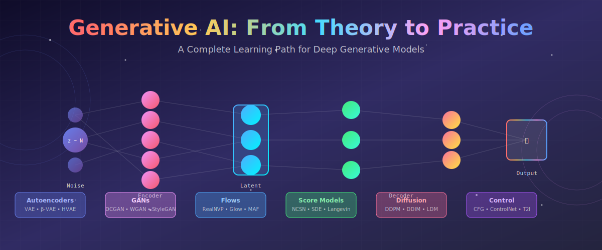
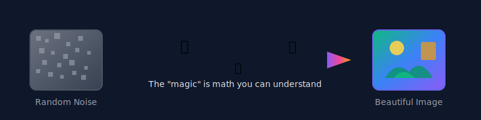
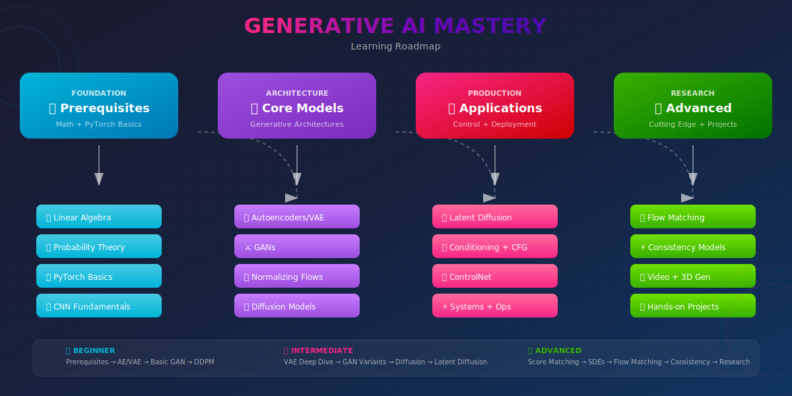
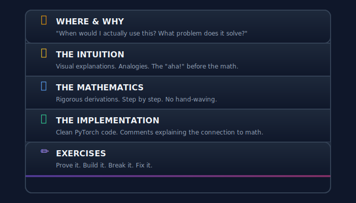

# ✨ Generative AI: The Complete Journey

<div align="center">



<br/>

### 🌟 *From Mathematical First Principles to State-of-the-Art Generation* 🌟

<br/>

[](#)
[](#)
[](#)

---

*"The universe is made of stories, not atoms." — Muriel Rukeyser*

**And generative AI? It learns to tell new stories from the ones it's heard.**

</div>

---

## 🎬 The Story So Far...

> **Imagine this:** You describe "a cat wearing a tiny astronaut suit, floating in space with Earth in the background, painted in the style of Studio Ghibli" — and within seconds, that exact image materializes before you.
>
> **This is not science fiction. This is 2024.**

The journey from "neural networks can classify cats vs dogs" to "neural networks can imagine anything" is one of the most remarkable stories in computer science. And you're about to learn exactly how it happened.

<div align="center">



</div>

---

## 💡 Why This Repository?

### The Problem with Most Resources

<table>
<tr>
<td width="50%">

#### ❌ What's Out There
- Papers assume you know everything
- Tutorials skip the math
- Code without explanation
- Theory without implementation
- Disconnected concepts

</td>
<td width="50%">

#### ✅ What You'll Find Here
- **Step-by-step derivations** you can follow
- **Visual intuitions** for every equation
- **Clean implementations** with comments
- **Connected learning path** building on itself
- **"Aha!" moments** designed into the flow

</td>
</tr>
</table>

---

## 🗺️ Your Learning Adventure

<div align="center">



</div>

### The Five Acts of Generative AI

<table>
<tr>
<td align="center" width="20%">

### 🌱
### **Act I**
**Foundations**

*Where you build the mathematical intuition*

[Prerequisites](./00_prerequisites/) → [Autoencoders](./01_autoencoders/)

</td>
<td align="center" width="20%">

### ⚔️
### **Act II**
**The GAN Wars**

*Where Generator battles Discriminator*

[GANs](./02_gans/)

</td>
<td align="center" width="20%">

### 🌊
### **Act III**
**Probability Flows**

*Where we learn exact likelihoods*

[Flows](./03_normalizing_flows/) → [Score Models](./04_score_based_models/)

</td>
<td align="center" width="20%">

### 🔮
### **Act IV**
**The Diffusion Revolution**

*Where noise becomes art*

[Diffusion](./05_diffusion_models/) → [Latent Diffusion](./06_latent_diffusion/)

</td>
<td align="center" width="20%">

### 🚀
### **Act V**
**Mastery & Beyond**

*Where you push boundaries*

[Control](./07_conditioning_and_control/) → [Research](./09_advanced_research_topics/)

</td>
</tr>
</table>

---

## 📚 The Complete Curriculum

<details open>
<summary><h3>🌱 Foundations</h3></summary>

<table>
<tr>
<th width="5%">#</th>
<th width="20%">Module</th>
<th width="40%">What You'll Master</th>
<th width="35%">The Hook</th>
</tr>
<tr>
<td>📋</td>
<td><b><a href="./00_prerequisites/">Prerequisites</a></b></td>
<td>Linear algebra, probability, information theory, PyTorch</td>
<td><em>"Why is KL divergence not symmetric? And why does that matter for VAEs?"</em></td>
</tr>
<tr>
<td>🔄</td>
<td><b><a href="./01_autoencoders/">Autoencoders</a></b></td>
<td>Vanilla AE → Sparse → Denoising → VAE → β-VAE → HVAE</td>
<td><em>"Compress an image to 20 numbers, then reconstruct it. Now make those numbers meaningful."</em></td>
</tr>
</table>

</details>

<details>
<summary><h3>⚔️ The Adversarial Era</h3></summary>

<table>
<tr>
<th width="5%">#</th>
<th width="20%">Module</th>
<th width="40%">What You'll Master</th>
<th width="35%">The Hook</th>
</tr>
<tr>
<td>⚔️</td>
<td><b><a href="./02_gans/">GANs</a></b></td>
<td>DCGAN, WGAN, StyleGAN, CycleGAN, evaluation metrics</td>
<td><em>"A forger and a detective, locked in an eternal battle — until both become perfect."</em></td>
</tr>
</table>

</details>

<details>
<summary><h3>🌊 Exact Likelihoods</h3></summary>

<table>
<tr>
<th width="5%">#</th>
<th width="20%">Module</th>
<th width="40%">What You'll Master</th>
<th width="35%">The Hook</th>
</tr>
<tr>
<td>🌊</td>
<td><b><a href="./03_normalizing_flows/">Normalizing Flows</a></b></td>
<td>Planar/Radial flows, RealNVP, Glow, coupling layers</td>
<td><em>"Transform simple noise into complex distributions — and know exactly how likely each sample is."</em></td>
</tr>
<tr>
<td>📈</td>
<td><b><a href="./04_score_based_models/">Score Models</a></b></td>
<td>Score matching, Langevin dynamics, SDEs</td>
<td><em>"Don't model the probability — model its gradient. Trust me, it's easier."</em></td>
</tr>
</table>

</details>

<details>
<summary><h3>🔮 The Diffusion Revolution</h3></summary>

<table>
<tr>
<th width="5%">#</th>
<th width="20%">Module</th>
<th width="40%">What You'll Master</th>
<th width="35%">The Hook</th>
</tr>
<tr>
<td>🎲</td>
<td><b><a href="./05_diffusion_models/">Diffusion</a></b></td>
<td>DDPM, DDIM, guidance, noise schedules</td>
<td><em>"Learn to denoise, and you've learned to generate. It's that simple. And that profound."</em></td>
</tr>
<tr>
<td>🖼️</td>
<td><b><a href="./06_latent_diffusion/">Latent Diffusion</a></b></td>
<td>Latent space, cross-attention, Stable Diffusion</td>
<td><em>"Why diffuse in pixel space when you can diffuse in meaning space?"</em></td>
</tr>
</table>

</details>

<details>
<summary><h3>🚀 Mastery & Production</h3></summary>

<table>
<tr>
<th width="5%">#</th>
<th width="20%">Module</th>
<th width="40%">What You'll Master</th>
<th width="35%">The Hook</th>
</tr>
<tr>
<td>🎛️</td>
<td><b><a href="./07_conditioning_and_control/">Control</a></b></td>
<td>Text-to-Image, ControlNet, Inpainting, CLIP</td>
<td><em>"From 'make an image' to 'make THIS image' — the art of precise control."</em></td>
</tr>
<tr>
<td>⚡</td>
<td><b><a href="./08_systems_and_optimization/">Systems</a></b></td>
<td>Mixed precision, distributed training, inference optimization</td>
<td><em>"Theory is beautiful. But can it run on my GPU?"</em></td>
</tr>
<tr>
<td>🔬</td>
<td><b><a href="./09_advanced_research_topics/">Research</a></b></td>
<td>Flow matching, consistency models, video, 3D</td>
<td><em>"The cutting edge. Where the next breakthrough is waiting."</em></td>
</tr>
<tr>
<td>🛠️</td>
<td><b><a href="./10_projects/">Projects</a></b></td>
<td>GAN from scratch, Diffusion, Text-to-Image mini</td>
<td><em>"You don't truly understand until you build it yourself."</em></td>
</tr>
</table>

</details>

---

## 🧮 The Mathematical Heart

> **"Mathematics is the language in which God has written the universe."** — Galileo Galilei
>
> For generative AI, that language is probability theory.

Every generative model answers the same question differently:

<div align="center">

### *How do we learn to sample from a distribution we only see examples from?*

</div>

<table>
<tr>
<th width="15%">Model</th>
<th width="45%">The Objective</th>
<th width="40%">The Intuition</th>
</tr>
<tr>
<td><b>🔄 VAE</b></td>
<td>

$$\mathcal{L} = \underbrace{\mathbb{E}[\log p(x|z)]}_{\text{reconstruction}} - \underbrace{D_{KL}(q(z|x) \| p(z))}_{\text{regularization}}$$

</td>
<td><em>"Compress to latent space, reconstruct faithfully, but keep the latent space nice and Gaussian."</em></td>
</tr>
<tr>
<td><b>⚔️ GAN</b></td>
<td>

$$\min_G \max_D \; \mathbb{E}[\log D(x)] + \mathbb{E}[\log(1 - D(G(z)))]$$

</td>
<td><em>"Generator creates fakes. Discriminator catches them. They battle until fakes are perfect."</em></td>
</tr>
<tr>
<td><b>🌊 Flow</b></td>
<td>

$$\log p(x) = \log p(f^{-1}(x)) + \log\left|\det \frac{\partial f^{-1}}{\partial x}\right|$$

</td>
<td><em>"Stretch and squeeze simple noise through invertible transforms until it looks like data."</em></td>
</tr>
<tr>
<td><b>🎲 Diffusion</b></td>
<td>

$$\mathcal{L} = \mathbb{E}_{t,x_0,\epsilon}\left[\|\epsilon - \epsilon_\theta(x_t, t)\|^2\right]$$

</td>
<td><em>"Learn to predict the noise that was added. Do it in reverse, and you're generating."</em></td>
</tr>
<tr>
<td><b>✨ Flow Matching</b></td>
<td>

$$\mathcal{L} = \mathbb{E}_{t,x_0,x_1}\left[\|v_\theta(x_t, t) - (x_1 - x_0)\|^2\right]$$

</td>
<td><em>"Walk in a straight line from noise to data. Learn the direction at each point."</em></td>
</tr>
</table>

---

## 🛤️ Choose Your Path

<table>
<tr>
<th width="25%">Your Background</th>
<th width="25%">Time Available</th>
<th width="50%">Recommended Journey</th>
</tr>
<tr>
<td>

### 🌱 Beginner
*"I know Python and basic ML"*

</td>
<td>4-6 weeks</td>
<td>

```
Prerequisites (focus on probability)
        ↓
Vanilla Autoencoder → VAE
        ↓
Basic GAN → DCGAN
        ↓
DDPM basics
```

</td>
</tr>
<tr>
<td>

### 🌿 Intermediate
*"I've trained neural networks"*

</td>
<td>2-3 months</td>
<td>

```
VAE deep dive (ELBO, reparameterization)
        ↓
GAN variants (WGAN-GP, StyleGAN)
        ↓
Diffusion theory → DDPM → DDIM
        ↓
Latent Diffusion → Text-to-Image
```

</td>
</tr>
<tr>
<td>

### 🌳 Advanced
*"I read papers for breakfast"*

</td>
<td>3-6 months</td>
<td>

```
Score matching → SDE formulation
        ↓
Flow matching → Rectified flow
        ↓
ControlNet → Consistency models
        ↓
Open research problems → Contribute!
```

</td>
</tr>
<tr>
<td>

### 🏭 Industry
*"I need production skills NOW"*

</td>
<td>1-2 months</td>
<td>

```
Stable Diffusion architecture
        ↓
ControlNet → Inpainting
        ↓
Systems optimization → Deployment
        ↓
Inference acceleration
```

</td>
</tr>
</table>

---

## 🏆 By the End of This Journey

You won't just *understand* generative AI. You'll be able to:

<table>
<tr>
<td width="33%" align="center">

### 🔬 **Reason**
About novel architectures and why they work

</td>
<td width="33%" align="center">

### 🛠️ **Build**
Working generative models from scratch

</td>
<td width="33%" align="center">

### 🚀 **Innovate**
And contribute to the cutting edge

</td>
</tr>
</table>

| Level | What You'll Build | Skills Demonstrated |
|:-----:|-------------------|---------------------|
| 🌱 | **MNIST VAE** | Latent spaces, reconstruction, sampling |
| 🌱 | **Simple GAN** | Adversarial training, mode collapse debugging |
| 🌿 | **Conditional DDPM** | Diffusion fundamentals, classifier-free guidance |
| 🌿 | **Image-to-Image** | Latent diffusion, cross-attention |
| 🌳 | **Mini Stable Diffusion** | Full text-to-image pipeline |
| 🌳 | **ControlNet Clone** | Fine-grained spatial control |
| 🌳 | **Optimized Inference** | Production-ready deployment |

---

## 📖 How Each Module Works

Every topic in this repository follows the same rhythm:

<div align="center">



</div>

---

## 📚 The Greatest Hits

### Papers That Changed Everything

| Year | Paper | Why It Matters |
|:----:|-------|----------------|
| 2013 | **Kingma & Welling** — *Auto-Encoding Variational Bayes* | Gave us VAEs: probabilistic latent spaces |
| 2014 | **Goodfellow et al.** — *Generative Adversarial Networks* | The adversarial revolution begins |
| 2015 | **Rezende & Mohamed** — *Variational Inference with Normalizing Flows* | Exact likelihoods through invertible transforms |
| 2020 | **Ho et al.** — *Denoising Diffusion Probabilistic Models* | Diffusion becomes competitive |
| 2021 | **Song et al.** — *Score-Based Generative Modeling through SDEs* | Unified theory: score + diffusion |
| 2022 | **Rombach et al.** — *High-Resolution Image Synthesis with LDMs* | Latent diffusion = Stable Diffusion |
| 2023 | **Lipman et al.** — *Flow Matching for Generative Modeling* | Straight paths, faster sampling |
| 2023 | **Song et al.** — *Consistency Models* | One-step generation! |

### Books for the Journey

- 📕 **Deep Learning** (Goodfellow, Bengio, Courville) — The foundations
- 📗 **Pattern Recognition and Machine Learning** (Bishop) — Probabilistic thinking
- 📘 **Probabilistic Machine Learning: Advanced Topics** (Murphy) — Modern generative models

---

## 🎨 A Visual Language

Every major concept gets its own custom SVG visualization. No more squinting at pixelated screenshots or decoding ASCII art.

<div align="center">

*Because understanding should be beautiful.*

</div>

---

## 🤝 Join the Journey

This is a living document. You can help by:

| Contribution | Impact |
|--------------|--------|
| 📝 **Fix a typo** | Small acts, big clarity |
| 🎨 **Improve a visualization** | A picture = 1000 equations |
| 📐 **Spot a math error** | Rigor matters |
| 💡 **Suggest an intuition** | Share your "aha!" |
| 📚 **Add a reference** | Standing on shoulders of giants |

---

## 📜 License

This educational content is provided under the **MIT License** for learning purposes.

---

<div align="center">

## 🚀 Ready to Begin?

<br/>

### The journey of a thousand models begins with a single gradient.

<br/>

**Start here →** [Prerequisites](./00_prerequisites/)

or jump straight to your interest:

[Autoencoders](./01_autoencoders/) • [GANs](./02_gans/) • [Flows](./03_normalizing_flows/) • [Diffusion](./05_diffusion_models/) • [Stable Diffusion](./06_latent_diffusion/)

---

<br/>

⭐ **If this helps you understand generative AI, star the repo!** ⭐

<br/>

*"The best way to understand a generative model is to generate one yourself."*

</div>
